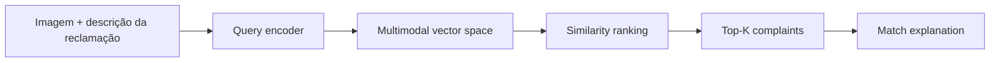
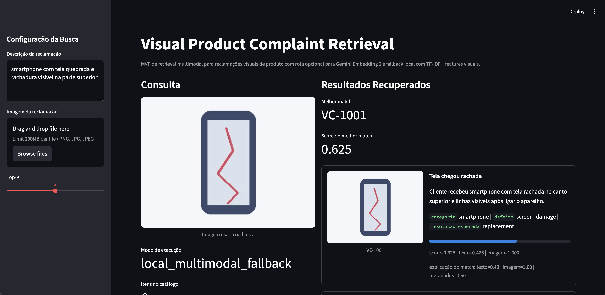

# Visual Product Complaint Retrieval

## Português

`visual-product-complaint-retrieval` é um MVP de busca multimodal para reclamações visuais de produto. A solução indexa um catálogo sintético de ocorrências com texto e imagem, recebe uma nova reclamação e recupera os casos mais semelhantes para apoiar triagem, customer experience e priorização de qualidade.

### Objetivo técnico

O projeto foi desenhado para explorar o uso de embeddings multimodais no contexto de pós-venda e qualidade de produto:

- indexação de reclamações com descrição textual e evidência visual;
- recuperação por similaridade para localizar casos análogos;
- explicação do match com decomposição por texto, imagem e metadados;
- rota opcional para `Gemini Embedding 2`, com fallback local reproduzível.

### Por que o Gemini Embedding 2 é importante aqui

O ponto central deste projeto é demonstrar por que um modelo de embedding multimodal muda a qualidade arquitetural de um sistema de busca para reclamações visuais.

Com `Gemini Embedding 2`, texto, imagem, vídeo, áudio e documentos podem ser projetados no mesmo espaço vetorial. Para este caso de uso, isso é importante porque a reclamação real raramente chega em um único formato. Em operações de customer care e product quality, é comum receber:

- descrição textual do defeito;
- foto do produto danificado;
- print de embalagem ou etiqueta;
- PDF de ordem, nota ou evidência complementar.

Em uma arquitetura tradicional, cada modalidade tenderia a exigir pipelines separados de representação e matching. O `Gemini Embedding 2` reduz essa fragmentação ao permitir retrieval cross-modal em um espaço semântico unificado. Na prática, isso significa que uma imagem de um frasco vazando pode recuperar não apenas imagens semelhantes, mas também descrições textuais, PDFs ou outros registros semanticamente correlatos.

Do ponto de vista técnico, a importância do modelo neste projeto se apoia em quatro vantagens:

1. `Espaço vetorial unificado`
   Evita a necessidade de manter índices independentes para texto e imagem.
2. `Entrada intercalada entre modalidades`
   Permite compor a query com imagem + texto na mesma chamada, o que aproxima o sistema do cenário operacional real.
3. `Cobertura multimodal nativa`
   Amplia o projeto para evoluções futuras com vídeos curtos de defeito, áudios de atendimento e PDFs de evidência.
4. `Flexibilidade de dimensionalidade`
   O modelo suporta redução de dimensionalidade para equilibrar qualidade de recuperação e custo de armazenamento.

Por isso, mesmo que o MVP rode localmente com um fallback reproduzível, o valor arquitetural mais forte do projeto está em estar preparado para `Gemini Embedding 2` como motor de indexação multimodal de produção.

### Arquitetura



### Stack

- `Gemini Embedding 2` como rota multimodal opcional
- `TF-IDF + cosine similarity` como baseline local reproduzível
- `Pillow` para geração de imagens demo e extração de sinais visuais
- `Streamlit` para inspeção técnica dos resultados
- `unittest` para validação automatizada

### Modo de execução

O projeto possui dois modos:

1. `gemini_embedding_2`
   Ativado quando existe `GEMINI_API_KEY` e o runtime `google-genai` está disponível.
2. `local_multimodal_fallback`
   Usa representação híbrida com:
   - vetor textual em `TF-IDF`
   - vetor visual baseado em histograma e bordas
   - combinação ponderada com `cosine similarity`

### Dataset demo

O catálogo sintético é gerado em runtime em [data/raw/complaints_catalog.csv](data/raw/complaints_catalog.csv) com `6` ocorrências:

- smartphone com tela rachada
- frasco de produto de limpeza vazando
- headphone com estrutura quebrada
- copo de liquidificador amassado
- frigideira com riscos internos
- camisa com costura rasgada

As imagens de apoio são geradas localmente em `data/raw/images/`.

### Artefato gerado

O pipeline salva um relatório em:

- `data/processed/retrieval_results.json`

Esse arquivo é gerado em runtime e não é versionado.

### Execução

```bash
python3 main.py
streamlit run app.py
python3 -m unittest discover -s tests -v
```

### Resultado atual da demo

- `runtime_mode = local_multimodal_fallback`
- `catalog_size = 6`
- `top_match_id = VC-1001`

### Interface



### Referências oficiais

- [Gemini Embedding 2 announcement](https://blog.google/innovation-and-ai/models-and-research/gemini-models/gemini-embedding-2/)
- [Gemini API embeddings documentation](https://ai.google.dev/gemini-api/docs/embeddings)

---

## English

`visual-product-complaint-retrieval` is a multimodal retrieval MVP for visual product complaints. The system indexes a synthetic complaint catalog containing text and image evidence, receives a new complaint query, and retrieves the most similar historical cases to support triage and product quality operations.

### Technical scope

- complaint indexing with text and image context
- Top-K similarity retrieval
- match explainability across textual, visual, and metadata signals
- optional `Gemini Embedding 2` runtime path with a reproducible local fallback

### Runtime modes

- `gemini_embedding_2`: enabled when `GEMINI_API_KEY` and `google-genai` are available
- `local_multimodal_fallback`: uses `TF-IDF`, handcrafted visual descriptors, and cosine similarity

### Why Gemini Embedding 2 matters in this project

The main architectural value of this repository is not just similarity search, but the ability to treat heterogeneous complaint evidence as a single retrieval problem.

`Gemini Embedding 2` matters because it maps multiple modalities into one shared vector space. In a product complaint workflow, real evidence often arrives as:

- free-form text written by the customer
- product damage photos
- packaging or label screenshots
- supporting PDFs or other attached documents

Without a multimodal embedding layer, teams usually need separate text and image pipelines and then have to reconcile their outputs downstream. A native multimodal embedding model simplifies that architecture and makes cross-modal retrieval much more natural.

For this MVP, the importance of `Gemini Embedding 2` is concentrated in four properties:

1. `Unified semantic space`
   Text and image evidence can be retrieved through the same index.
2. `Interleaved multimodal input`
   Queries can be composed from text plus image evidence together.
3. `Native multimodal coverage`
   The same foundation can later support video, audio, and document evidence.
4. `Flexible output dimensionality`
   Storage footprint and retrieval quality can be balanced depending on operational constraints.

This is why the repository keeps a local fallback for reproducibility, but is intentionally structured around `Gemini Embedding 2` as the production-grade multimodal retrieval path.

### Generated artifact

- `data/processed/retrieval_results.json`

This artifact is generated at runtime and is not versioned.

### Validation

```bash
python3 main.py
python3 -m unittest discover -s tests -v
```

### Interface


