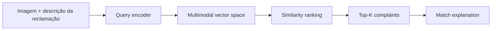

# Visual Product Complaint Retrieval

## Português

`visual-product-complaint-retrieval` é um MVP de busca multimodal para reclamações visuais de produto. A solução indexa um catálogo sintético de ocorrências com texto e imagem, recebe uma nova reclamação e recupera os casos mais semelhantes para apoiar triagem, customer experience e priorização de qualidade.

### Objetivo técnico

O projeto foi desenhado para explorar o uso de embeddings multimodais no contexto de pós-venda e qualidade de produto:

- indexação de reclamações com descrição textual e evidência visual;
- recuperação por similaridade para localizar casos análogos;
- explicação do match com decomposição por texto, imagem e metadados;
- rota opcional para `Gemini Embedding 2`, com fallback local reproduzível.

### Arquitetura



### Stack

- `Gemini Embedding 2` como rota multimodal opcional
- `TF-IDF + cosine similarity` como baseline local reproduzível
- `Pillow` para geração de imagens demo e extração de sinais visuais
- `Streamlit` para inspeção técnica dos resultados
- `unittest` para validação automatizada

### Modo de execução

O projeto possui dois modos:

1. `gemini_embedding_2`
   Ativado quando existe `GEMINI_API_KEY` e o runtime `google-genai` está disponível.
2. `local_multimodal_fallback`
   Usa representação híbrida com:
   - vetor textual em `TF-IDF`
   - vetor visual baseado em histograma e bordas
   - combinação ponderada com `cosine similarity`

### Dataset demo

O catálogo sintético é gerado em runtime em [data/raw/complaints_catalog.csv](data/raw/complaints_catalog.csv) com `6` ocorrências:

- smartphone com tela rachada
- frasco de produto de limpeza vazando
- headphone com estrutura quebrada
- copo de liquidificador amassado
- frigideira com riscos internos
- camisa com costura rasgada

As imagens de apoio são geradas localmente em `data/raw/images/`.

### Artefato gerado

O pipeline salva um relatório em:

- `data/processed/retrieval_results.json`

Esse arquivo é gerado em runtime e não é versionado.

### Execução

```bash
python3 main.py
streamlit run app.py
python3 -m unittest discover -s tests -v
```

### Resultado atual da demo

- `runtime_mode = local_multimodal_fallback`
- `catalog_size = 6`
- `top_match_id = VC-1001`

### Referências oficiais

- [Gemini Embedding 2 announcement](https://blog.google/innovation-and-ai/models-and-research/gemini-models/gemini-embedding-2/)
- [Gemini API embeddings documentation](https://ai.google.dev/gemini-api/docs/embeddings)

---

## English

`visual-product-complaint-retrieval` is a multimodal retrieval MVP for visual product complaints. The system indexes a synthetic complaint catalog containing text and image evidence, receives a new complaint query, and retrieves the most similar historical cases to support triage and product quality operations.

### Technical scope

- complaint indexing with text and image context
- Top-K similarity retrieval
- match explainability across textual, visual, and metadata signals
- optional `Gemini Embedding 2` runtime path with a reproducible local fallback

### Runtime modes

- `gemini_embedding_2`: enabled when `GEMINI_API_KEY` and `google-genai` are available
- `local_multimodal_fallback`: uses `TF-IDF`, handcrafted visual descriptors, and cosine similarity

### Generated artifact

- `data/processed/retrieval_results.json`

This artifact is generated at runtime and is not versioned.

### Validation

```bash
python3 main.py
python3 -m unittest discover -s tests -v
```
